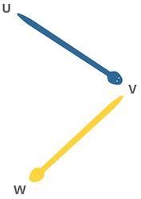

# colubridae

Colubridae is a Python package for applied category theory (ACT).

For more information, please check this [brief introduction](https://alpof.wordpress.com/2019/12/29/a-new-python-package-for-applied-category-theory/).

## Installation

### Dependencies

Colubridae requires:

- Python (>= 3.4)

### User installation

Colubridae can be installed directly from source:

    $ python setup.py install   

## Development

We welcome new contributors of all experience levels. The preferred way to
contribute to colubridae is to fork the main repository on GitHub,
then submit a “pull request” (PR). Bug reports and discussion on new features
(only) can be posted in the [corresponding GitHub issues](https://github.com/AlexPof/colubridae/issues).
Preferably, the development of new features should be discussed beforehand
on this page.

### Source code

You can check the latest sources with the command:

    >>> git clone https://github.com/AlexPof/colubridae.git

## Testing / Tutorial

Please see the *examples.ipynb* Jupyter notebook provided in the repository.

## Help and Support

### Documentation

Full documentation will be available in the future.

### Communication

Please use the [GitHub issues page](https://github.com/AlexPof/colubridae/issues).
